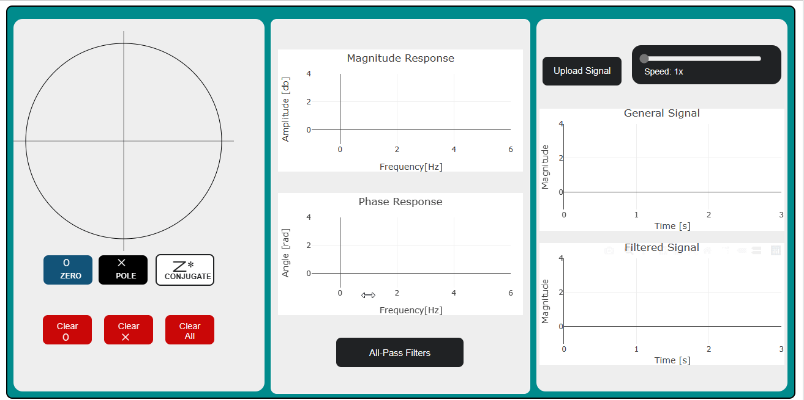

# Digital-Filter-Design

This project is a web application that allows users to design custom digital filters by manipulating zeros and poles on the Z-plane. With an intuitive interface and interactive features, users can easily create and modify filters to meet their specific requirements. The application also provides real-time filtering capabilities and the ability to correct for phase distortion using All-Pass filters.

## Table of Contents

- [Built with](#Built-with)
- [Features](#Features)
- [Preview](#Preview)
- [Authors](#Authors)
- [Acknowledgements](#Acknowledgements)

## Built with
<table>
  <tr>
    <td>
      
    </td>
    <td>
      
    </td>
    <td>
      
    </td>
    <td>
      
    </td>
    <td>
      
    </td>
  </tr>
</table>

## Features

The Z-Plane Filter Designer offers the following features:

- **Z-Plane Visualization**: A plot of the Z-plane with the unit circle allows users to place zeros and poles by clicking on the graph. Users can easily modify the placement by dragging the elements.
- **Modification Options**: Users can modify the placed zeros and poles by dragging them to new locations. Additionally, individual elements can be deleted by clicking on them. The application provides options to clear all zeros, clear all poles, or clear all elements at once.
- **Conjugate Support**: Users have the choice to add complex elements with their conjugates or only use the individual components.
- **Frequency Response Visualization**: The application generates two graphs, one for the magnitude response and another for the phase response, allowing users to visualize the frequency response of the designed filter based on the placed elements.

## Preview

## Authors

| Name | GitHub | LinkedIn |
| ---- | ------ | -------- |
| Omar Adel Hassan | [@Omar_Adel](https://github.com/omar-adel1) |  |
| Sharif Ehab | [@Sharif_Ehab](https://github.com/SharifEhab) |  |
| Mostafa Khaled | [@Mostafa_Khaled](https://github.com/MostafaDarwish93) |  |
| Zyad Sowalim | [@Zyad_Sowalim](https://github.com/Zyadsowilam) |  |

## Acknowledgements

Submitted to: Dr. Tamer Basha & Eng. Christina Adly

All rights reserved © 2023 to Team 4 - HealthCare Engineering and Management, Cairo University (Class 2025)

